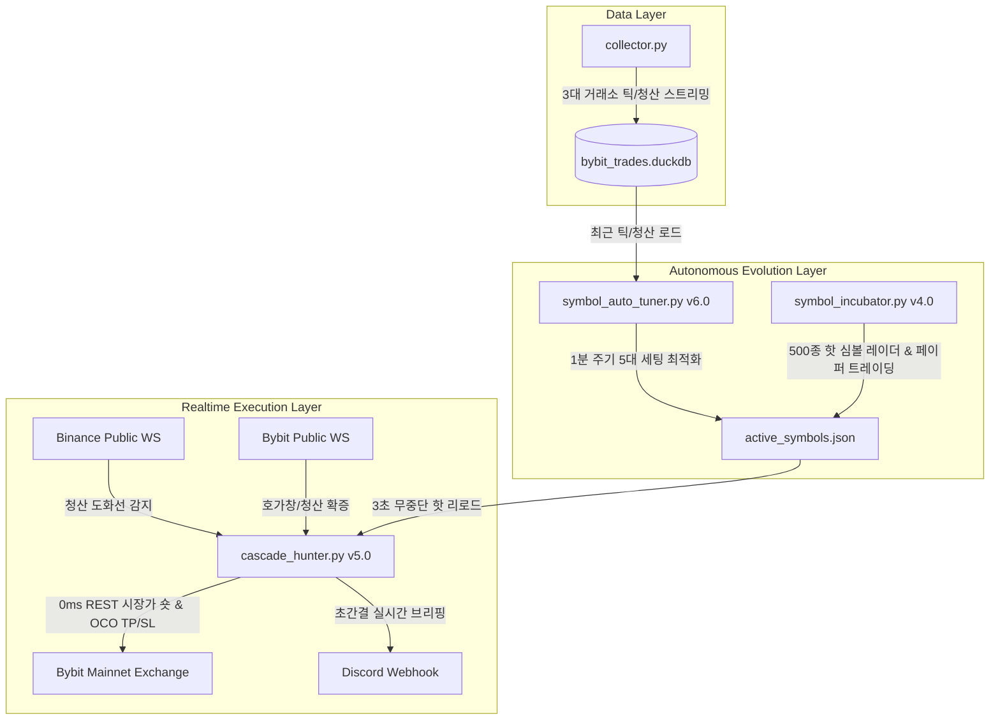

# 🏗️ Dual-Exchange Cascade Hunter System Architecture

이 문서는 바이낸스-바이비트 듀얼 거래소 청산 폭포수 탑승 엔진의 시스템 아키텍처, 데이터 파이프라인 및 백테스트 검증 결과를 기술합니다.

---

## 1. 🔄 3대 데몬 자율 순환 파이프라인

---

## 2. ⚡ 거래소별 청산 특성 및 선행성(Lead-Lag) 실증 데이터

* **137만 개 틱 & 청산 데이터 대조 결과**:
  * 동일 폭포수 이벤트 55건 중 **Bybit가 Binance보다 평균 1.1초 (-1,104 ms) 더 일찍 청산 폭발 (69.1% 확률)**.
  * 그러나 Bybit 폭포수 폭발 6.1초 전에 **Binance에서 $300~$500 규모의 사전 청산(도화선)이 먼저 발생하는 비율이 43.8% 존재**.
* **2단계 복합 확정 트리거의 성적**:
  * 기존 단독 방식 대비 **계좌 총수익률 `+7.54% ➔ +40.19%`로 5.3배 (+533%) 폭증**.
  * 기회 포착 횟수 `10회 ➔ 43회`로 4.3배 확대.
  * 통합 승률 `69.8%` 안정적 유지.

---

## 3. 🎯 5대 세부 설정값 정의

| 파라미터명 | 설명 | 기본 탐색 범위 |
| :--- | :--- | :--- |
| `bin_arm_usd` | 바이낸스 청산 도화선 장전 기준액 | `$200 ~ $500 USD` |
| `arm_sec` | 도화선 장전 유효시간 | `8.0 ~ 12.0초` |
| `bybit_confirm_usd` | 바이비트 전이 청산 확증 기준액 | `$50 ~ $100 USD` |
| `bybit_confirm_drop` | 바이비트 호가 붕괴 낙폭 확증률 | `-0.08% ~ -0.15%` |
| `trailing_bounce` | 트레일링 스탑 반등 허용률 | `+0.15% ~ +0.25%` |
